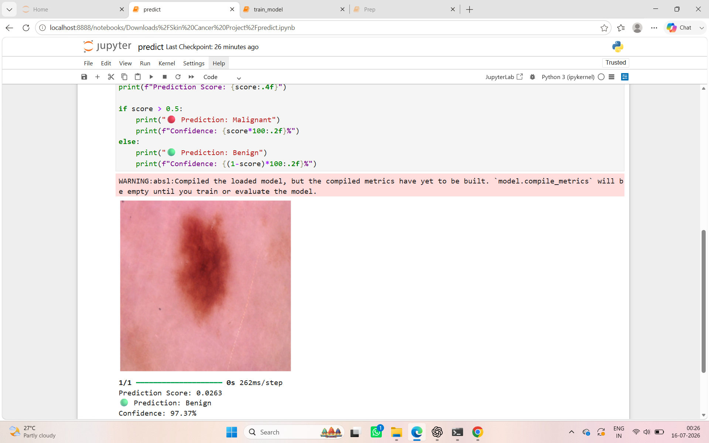
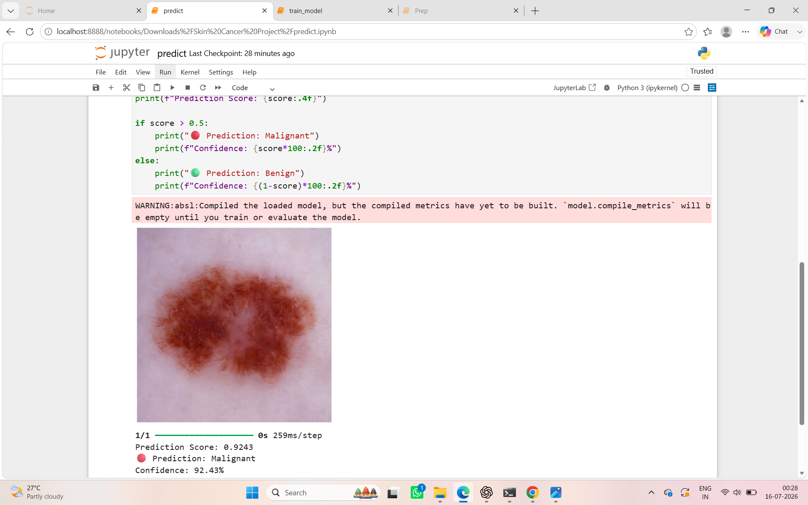

# Skin Cancer Detection Using Deep Learning

## Overview

This project implements a Deep Learning-based Skin Cancer Detection System using Convolutional Neural Networks (CNNs) to classify skin lesion images as **Benign** or **Malignant**.

The model was trained on the HAM10000 Skin Cancer Dataset and developed using TensorFlow and Keras. The project demonstrates the complete machine learning workflow, including data preprocessing, dataset balancing, model training, evaluation, and prediction.

---

## Problem Statement

Skin cancer is among the most common cancers worldwide. Early detection plays a crucial role in improving treatment outcomes and patient survival rates.

The objective of this project is to develop a CNN-based image classification model capable of identifying whether a skin lesion image is benign or malignant.

---

## Dataset

**HAM10000 (Human Against Machine with 10000 Training Images)**

The dataset contains dermatoscopic images of various skin lesion categories.

### Binary Classification Mapping

#### Malignant
- Melanoma (mel)

#### Benign
- Melanocytic Nevi (nv)
- Benign Keratosis-like Lesions (bkl)
- Basal Cell Carcinoma (bcc)
- Actinic Keratoses (akiec)
- Dermatofibroma (df)
- Vascular Lesions (vasc)

A balanced binary dataset was created using:
- 1113 Benign images
- 1113 Malignant images

---

## Technologies Used

- Python
- TensorFlow
- Keras
- NumPy
- Pandas
- Matplotlib
- Scikit-learn
- OpenCV

---

## Project Workflow

### 1. Data Preparation

- Loaded HAM10000 metadata
- Categorized images into Benign and Malignant classes
- Created a balanced dataset
- Split the dataset into:
  - Training Set
  - Validation Set
  - Test Set

### 2. Data Preprocessing

- Image resizing to 224 × 224 pixels
- Pixel normalization
- Data augmentation techniques:
  - Rotation
  - Zoom
  - Horizontal Flip

### 3. Model Development

A Convolutional Neural Network (CNN) was built using:

- Conv2D Layers
- MaxPooling Layers
- Flatten Layer
- Dense Layers
- Dropout Layer
- Sigmoid Output Layer

### 4. Model Training

The model was trained using TensorFlow and Keras with:

- Binary Crossentropy Loss
- Adam Optimizer
- Early Stopping
- Validation Monitoring

### 5. Prediction

The trained model can classify unseen skin lesion images as:

- Benign
- Malignant

---

## Model Performance

### Results

- Classification Accuracy: **Approximately 75–80%**
- Binary Classification:
  - Benign
  - Malignant

The model demonstrated effective classification performance on balanced skin lesion data and successfully identified benign and malignant samples during testing.

## Sample Predictions

### Benign Lesion Prediction



### Malignant Lesion Prediction




## Project Structure

```text
Skin-Cancer-Detection-Using-CNN/
│
├── prep.ipynb
├── train_model.ipynb
├── predict.ipynb
├── README.md
├── requirements.txt
```

---

## Installation

Clone the repository:

```bash
git clone https://github.com/yourusername/Skin-Cancer-Detection-Using-CNN.git
```

Move into the project directory:

```bash
cd Skin-Cancer-Detection-Using-CNN
```

Install required packages:

```bash
pip install -r requirements.txt
```

---

## Running the Project

### Step 1: Prepare Dataset

Run:

```bash
prep.ipynb
```

This notebook:
- Loads the HAM10000 dataset
- Creates binary classes
- Splits the dataset into training, validation, and testing sets

### Step 2: Train Model

Run:

```bash
train_model.ipynb
```

This notebook:
- Builds the CNN model
- Trains the model
- Evaluates performance
- Saves the trained model

### Step 3: Predict New Images

Run:

```bash
predict.ipynb
```

This notebook:
- Loads the saved model
- Accepts a new skin lesion image
- Predicts whether it is Benign or Malignant

---

## Model File

The trained model file (`skin_cancer_model.h5`) is not included in this repository due to GitHub file size limitations.

To recreate the model:

1. Download the HAM10000 dataset
2. Run `prep.ipynb`
3. Run `train_model.ipynb`
4. Generate `skin_cancer_model.h5`
5. Use `predict.ipynb` for predictions

---

## Future Improvements

- Transfer Learning using MobileNetV2
- Transfer Learning using ResNet50
- Multi-Class Skin Lesion Classification
- Web Application Deployment using Flask
- Improved Accuracy with Larger Datasets
- Model Explainability using Grad-CAM

---

## Learning Outcomes

Through this project, the following concepts were implemented and explored:

- Image Classification
- Convolutional Neural Networks (CNNs)
- Data Augmentation
- Binary Classification
- Deep Learning with TensorFlow
- Model Evaluation
- Medical Image Analysis

---

## Author

### Varshitha Agraharam

B.Tech – Computer Science and Engineering (Artificial Intelligence & Machine Learning)

---
## Disclaimer

This project is intended for educational and academic purposes only and should not be used for professional medical diagnosis.
